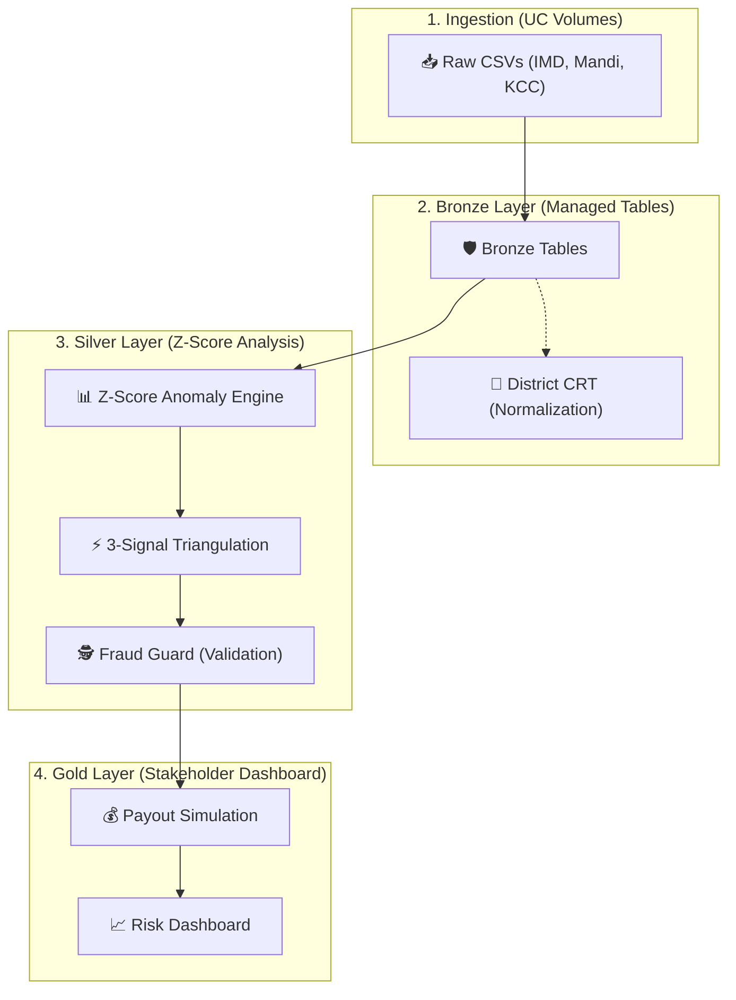

# 🌾 Krishi-Kavach
> **Parametric Crop Insurance Triangulation System**  
> Powered by Databricks · Unity Catalog · PySpark · Z-Score Anomaly Detection

---

## 📌 Overview
**Krishi-Kavach** ("Crop Shield") is a production-grade parametric insurance engine that cross-validates climate distress by triangulating 3 independent signals: **Weather Anomalies**, **Market Price Volatility**, and **Social Distress Queries** (Kisan Call Center).

By using **Z-Score based anomaly detection**, it identifies extreme climatic events with statistical precision, reducing insurance 'basis risk' for millions of Indian farmers.

---

---

## 🏛️ Architecture & How It Works
Krishi-Kavach is designed to eliminate **Basis Risk** in crop insurance by moving from a single-point weather station model to a **triangulated validation engine**.

### The "Triangulation" Idea:
Instead of relying only on a rain gauge (which might fail), our engine only triggers a payout if **at least two independent systems** confirm distress:
- **Satellite Signal**: rainfall Z-score indicates 1.5$\sigma$ deficit.
- **Market Signal**: Mandi price Z-score indicates a 1.5$\sigma$ spike (scarcity).
- **Social Signal**: High-volume farmer 'Weather' and 'Pest' inquiries in KCC logs.

---

## 🚀 Execution Workflow
To run the end-to-end pipeline in Databricks, follow this workflow:

1.  **`00_district_crt.py`**: Runs first to register the normalization UDF. It resolves naming conflicts (e.g. *Allahabad* to *Prayagraj*) across all datasets.
2.  **`01_bronze_layer.py`**: Ingests production CSVs from UC Volumes into governed tables.
3.  **`02_silver_layer.py`**: The heavy lifter—calculates rolling statistics, Z-scores, and generates the **Confidence Score**.
4.  **`fraud_guard.py`**: An automated integrity check that strips away suspicious triggers (e.g., social gaming).
5.  **`03_gold_payout_viz.py`**: Final simulation that joins triggers with PMFBY policies and renders the fiscal dashboard.

---

## 📊 The Triangulation Model

An event is confirmed if the **Weighted Confidence Score >= 0.60**:

| Signal | Source | Logic | Weight |
|--------|--------|-------|--------|
| **Weather** | IMD Rainfall | Rainfall Z-Score > 1.5$\sigma$ | **50%** |
| **Market** | Mandi Prices | Price Z-Score > 1.5$\sigma$ | **25%** |
| **Social** | KCC Queries | Query Volume Spikes | **25%** |

---

## 🛠️ Key Features
- **Dynamic Backtesting**: Use Databricks Widgets to adjust Z-score thresholds and payout rates live.
- **Fraud Guard**: Integrity layer to flag zero-weather high-confidence anomalies.
- **District CRT**: Autonomous resolution of historical/local district name variants.

---

## 📄 License
MIT © 2026 · Krishi-Kavach Team
